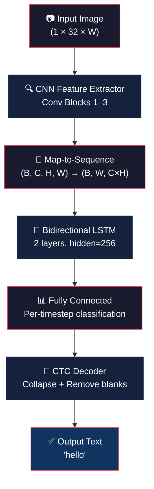
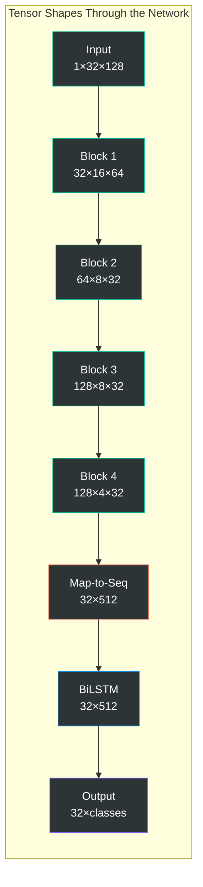
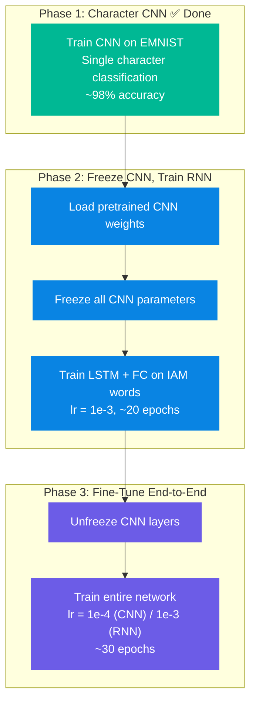
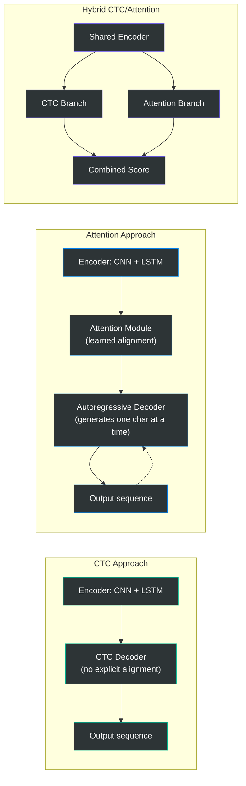
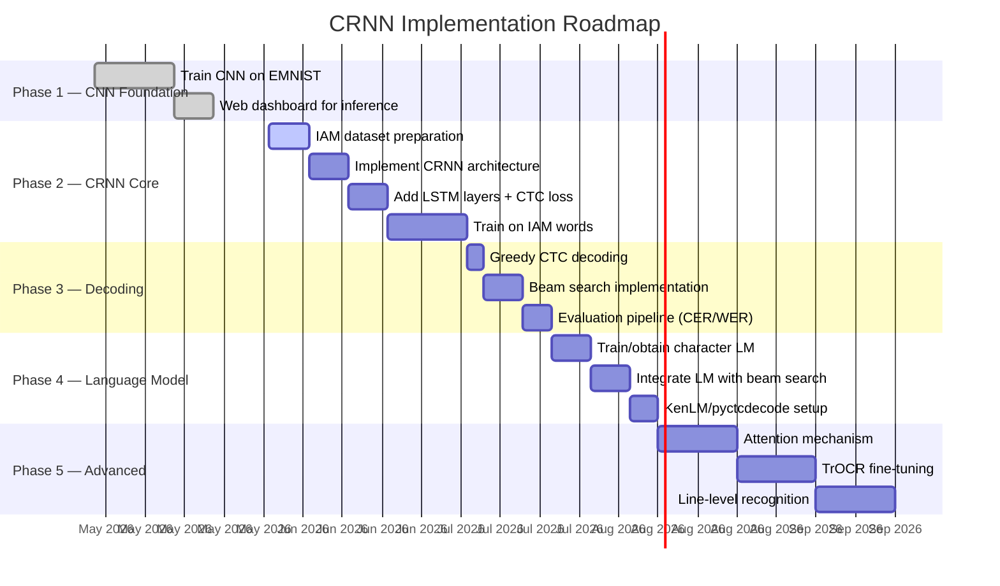

# Extending to Full Word & Sentence Recognition: CRNN Architecture Guide

> **Document Version:** 1.0  
> **Last Updated:** May 2026  
> **Scope:** Architectural guide for extending the single-character CNN classifier to a full-sequence Convolutional Recurrent Neural Network (CRNN) capable of recognizing handwritten words and sentences.

---

## Table of Contents

1. [Introduction](#1-introduction)
2. [Current CNN Foundation](#2-current-cnn-foundation)
3. [CRNN Architecture Design](#3-crnn-architecture-design)
   - 3.1 [Architecture Overview](#31-architecture-overview)
   - 3.2 [Map-to-Sequence Layer](#32-map-to-sequence-layer)
   - 3.3 [Recurrent Layers](#33-recurrent-layers)
   - 3.4 [CTC (Connectionist Temporal Classification) Loss](#34-ctc-connectionist-temporal-classification-loss)
4. [Training Data Requirements](#4-training-data-requirements)
   - 4.1 [Datasets for Word Recognition](#41-datasets-for-word-recognition)
   - 4.2 [Data Pipeline](#42-data-pipeline)
5. [Decoding Strategies](#5-decoding-strategies)
   - 5.1 [Greedy Decoding](#51-greedy-decoding)
   - 5.2 [Beam Search Decoding](#52-beam-search-decoding)
   - 5.3 [Language Model Integration](#53-language-model-integration)
6. [Transfer Learning Strategy](#6-transfer-learning-strategy)
7. [Advanced Extensions](#7-advanced-extensions)
   - 7.1 [Attention Mechanisms](#71-attention-mechanisms)
   - 7.2 [Segmentation-Free Recognition](#72-segmentation-free-recognition)
   - 7.3 [Writer Adaptation](#73-writer-adaptation)
8. [Performance Benchmarks](#8-performance-benchmarks)
9. [Implementation Roadmap](#9-implementation-roadmap)

---

## 1. Introduction

### Where We Are Today

Our current system is a **single-character CNN classifier** trained on EMNIST. Given a 28×28 grayscale image containing one isolated character, the model predicts which letter or digit it represents. This works well for constrained scenarios — but real-world handwriting recognition demands far more: entire words, sentences, and paragraphs must be read end-to-end.

### Where We're Going

The goal of this document is to chart a clear, implementable path from our character-level classifier to a **full-sequence recognition system** that can:

- Read entire handwritten words from images of arbitrary width.
- Scale to sentence-level and line-level recognition.
- Integrate language models for higher accuracy.

### Why CRNNs?

**Convolutional Recurrent Neural Networks (CRNNs)** are the industry-standard architecture for this task because they elegantly combine two complementary strengths:

| Component | Responsibility |
|---|---|
| **CNN (Convolutional)** | Extracts local visual features — strokes, curves, junctions — from the image. Shared weights make this translation-invariant. |
| **RNN (Recurrent)** | Models the sequential, left-to-right dependencies between characters. A "c" followed by "a" followed by "t" is not the same as "t-a-c". |
| **CTC (Loss/Decoder)** | Handles the alignment problem — we don't know *where* each character is in the image, only *what* characters appear in sequence. |

This combination was first formalized by Shi, Bai & Yao in their seminal 2015 paper *"An End-to-End Trainable Neural Network for Image-based Sequence Recognition"* and remains the backbone of most modern OCR systems.

---

## 2. Current CNN Foundation

### Architectural Recap

Our existing `HandwrittenCNN` follows a classic convolutional classifier pattern:

```
Input (1×28×28)
    │
    ▼
┌─────────────────────────┐
│  Conv2d(1→32, 3×3)      │
│  BatchNorm2d(32)         │
│  ReLU + MaxPool2d(2)     │   Block 1: Low-level features (edges, strokes)
└────────────┬────────────┘
             │  (32×14×14)
             ▼
┌─────────────────────────┐
│  Conv2d(32→64, 3×3)     │
│  BatchNorm2d(64)         │
│  ReLU + MaxPool2d(2)     │   Block 2: Mid-level features (curves, corners)
└────────────┬────────────┘
             │  (64×7×7)
             ▼
┌─────────────────────────┐
│  Conv2d(64→128, 3×3)    │
│  BatchNorm2d(128)        │
│  ReLU                    │   Block 3: High-level features (character parts)
└────────────┬────────────┘
             │  (128×7×7)
             ▼
┌─────────────────────────┐
│  Flatten                 │
│  FC(128×7×7 → 256)       │
│  ReLU + Dropout(0.5)     │   Classifier Head
│  FC(256 → num_classes)   │
└─────────────────────────┘
```

### What We Keep

The **convolutional feature extractor** (Blocks 1–3) is our most valuable asset. These layers have learned to detect handwriting-specific visual patterns — pen strokes, curves, loops, crossings — and this knowledge transfers directly to word-level recognition. The filters don't care whether they're looking at an isolated "e" or an "e" embedded in the word "hello"; the visual patterns are the same.

### What Changes

| Component | Status | Reason |
|---|---|---|
| Conv Blocks 1–3 | ✅ **Keep** | Learned features are reusable |
| Flatten layer | ❌ **Remove** | Destroys spatial ordering |
| FC classifier | ❌ **Remove** | Single-label output ≠ sequence output |
| New: Map-to-Sequence | 🆕 **Add** | Reshape feature maps for sequential input |
| New: Bi-LSTM layers | 🆕 **Add** | Model character-to-character dependencies |
| New: CTC output layer | 🆕 **Add** | Variable-length sequence output + loss |

The key insight is that the **Flatten** operation destroys the spatial (left-to-right) ordering of features. In a classifier, this doesn't matter — we just want to know *what* character it is. But in a sequence recognizer, the horizontal position of each feature is exactly the information the RNN needs.

---

## 3. CRNN Architecture Design

### 3.1 Architecture Overview

The full CRNN pipeline transforms a variable-width image into a variable-length character sequence:



**Data flow at each stage** (for a 32×128 input image processing the word "cat"):

| Stage | Tensor Shape | Interpretation |
|---|---|---|
| Input | `(B, 1, 32, 128)` | Grayscale image, fixed height, variable width |
| After CNN | `(B, 128, 7, 32)` | 128 feature maps, 7 high, 32 wide |
| After Map-to-Seq | `(B, 32, 896)` | 32 timesteps, each a 896-dim feature vector |
| After LSTM | `(B, 32, 512)` | 32 timesteps, 512 features (256×2 bidirectional) |
| After FC | `(B, 32, num_classes)` | 32 timesteps, probability over alphabet + blank |
| After CTC Decode | `"cat"` | Final recognized text |

---

### 3.2 Map-to-Sequence Layer

This is the critical bridge between the spatial CNN world and the sequential RNN world. The idea is beautifully simple:

**Each column of the feature map becomes one timestep in the sequence.**

```
CNN Feature Map (128 channels × 7 height × W width):

         Column 0    Column 1    Column 2    ...    Column W-1
        ┌────────┐  ┌────────┐  ┌────────┐        ┌────────┐
        │ 128×7  │  │ 128×7  │  │ 128×7  │        │ 128×7  │
        │features│  │features│  │features│  ...   │features│
        │  = 896 │  │  = 896 │  │  = 896 │        │  = 896 │
        └────┬───┘  └────┬───┘  └────┬───┘        └────┬───┘
             │           │           │                  │
             ▼           ▼           ▼                  ▼
         Timestep 0  Timestep 1  Timestep 2  ...  Timestep W-1
```

**Why does this work?**

Each column of the feature map has a **receptive field** that covers a vertical strip of the original image. Due to the max-pooling operations (each halves the spatial dimensions), column *i* in the feature map corresponds to a region roughly centered at horizontal position *4i* in the input image (since we pool twice: 2×2 = 4× horizontal reduction).

This means:
- Column 0 "sees" the left edge of the image (e.g., the first stroke of "h")
- Column 5 might "see" the middle of the "h"
- Column 15 might "see" the "e" in "hello"
- Column W-1 "sees" the right edge

The **reshape operation** is straightforward:

```python
# Feature map from CNN: (batch, channels, height, width)
# Example: (B, 128, 7, 32)

# Step 1: Move width to position 1 (width becomes the "time" axis)
conv = conv.permute(0, 3, 1, 2)  # (B, 32, 128, 7)

# Step 2: Flatten channels × height into a single feature vector per timestep
conv = conv.reshape(batch, width, channels * height)  # (B, 32, 896)
```

> **💡 Design Note:** The input image height is fixed (typically 32px) to ensure a consistent feature height after the CNN. The width is variable, which naturally produces a variable-length sequence — short words produce fewer timesteps, long words produce more.

---

### 3.3 Recurrent Layers

The recurrent component models dependencies between characters — the strokes of one character influence the interpretation of its neighbors.

#### Why Bidirectional?

Consider the ambiguous stroke fragment that could be either a "c" or an incomplete "e". Looking at what comes *after* resolves the ambiguity:
- If followed by an "a-t" → probably "cat"
- If followed by a "v-e-r" → probably "ever"

A **bidirectional LSTM** processes the sequence both left-to-right and right-to-left, giving each timestep full context:

```
Forward  LSTM:  h→e→l→l→o     (reads left-to-right)
                ↓ ↓ ↓ ↓ ↓
Backward LSTM:  h←e←l←l←o     (reads right-to-left)
                ↓ ↓ ↓ ↓ ↓
Concatenated:  [→h;←h] [→e;←e] [→l;←l] [→l;←l] [→o;←o]
               (each timestep gets 256+256 = 512 features)
```

#### Full CRNN Implementation

```python
import torch
import torch.nn as nn


class CRNN(nn.Module):
    """
    Convolutional Recurrent Neural Network for handwritten text recognition.

    Architecture: CNN Feature Extractor → Map-to-Sequence → BiLSTM → CTC Output

    Args:
        num_classes: Number of output classes (alphabet size + 1 for CTC blank).
        hidden_size: LSTM hidden state dimension (default: 256).
        num_layers: Number of stacked LSTM layers (default: 2).
    """

    def __init__(self, num_classes: int, hidden_size: int = 256, num_layers: int = 2):
        super().__init__()

        # ──────────────────────────────────────────────
        # CNN Backbone (reused from HandwrittenCNN)
        # ──────────────────────────────────────────────
        self.cnn = nn.Sequential(
            # Block 1: (1, 32, W) → (32, 16, W/2)
            nn.Conv2d(1, 32, kernel_size=3, padding=1),
            nn.BatchNorm2d(32),
            nn.ReLU(inplace=True),
            nn.MaxPool2d(2, 2),

            # Block 2: (32, 16, W/2) → (64, 8, W/4)
            nn.Conv2d(32, 64, kernel_size=3, padding=1),
            nn.BatchNorm2d(64),
            nn.ReLU(inplace=True),
            nn.MaxPool2d(2, 2),

            # Block 3: (64, 8, W/4) → (128, 8, W/4)
            nn.Conv2d(64, 128, kernel_size=3, padding=1),
            nn.BatchNorm2d(128),
            nn.ReLU(inplace=True),

            # Block 4 (optional deeper features): (128, 8, W/4) → (128, 4, W/4)
            nn.Conv2d(128, 128, kernel_size=3, padding=1),
            nn.BatchNorm2d(128),
            nn.ReLU(inplace=True),
            nn.MaxPool2d((2, 1), (2, 1)),  # Pool only in height, preserve width
        )

        # After CNN: feature maps of shape (batch, 128, 4, W/4)
        # → Each timestep feature: 128 channels × 4 height = 512

        # ──────────────────────────────────────────────
        # Recurrent Layers
        # ──────────────────────────────────────────────
        self.rnn = nn.LSTM(
            input_size=128 * 4,       # channels × height after CNN
            hidden_size=hidden_size,
            num_layers=num_layers,
            bidirectional=True,
            batch_first=True,
            dropout=0.2 if num_layers > 1 else 0,
        )

        # ──────────────────────────────────────────────
        # Output Layer (per-timestep classification)
        # ──────────────────────────────────────────────
        self.fc = nn.Linear(hidden_size * 2, num_classes)  # ×2 for bidirectional

    def forward(self, x: torch.Tensor) -> torch.Tensor:
        """
        Forward pass.

        Args:
            x: Input images of shape (batch, 1, 32, W) where W is variable.

        Returns:
            Log-probabilities of shape (batch, T, num_classes) where T = W/4.
        """
        # ── CNN Feature Extraction ──
        conv = self.cnn(x)  # (batch, 128, 4, W/4)

        # ── Map-to-Sequence ──
        batch, channels, height, width = conv.size()
        conv = conv.permute(0, 3, 1, 2)                # (batch, W/4, 128, 4)
        conv = conv.reshape(batch, width, channels * height)  # (batch, W/4, 512)

        # ── Recurrent Processing ──
        rnn_out, _ = self.rnn(conv)  # (batch, W/4, hidden_size×2)

        # ── Per-Timestep Classification ──
        output = self.fc(rnn_out)    # (batch, W/4, num_classes)

        # CTC expects log-probabilities
        output = torch.nn.functional.log_softmax(output, dim=2)

        return output
```

#### Architecture Dimensions Summary

For a 32×128 input image:



---

### 3.4 CTC (Connectionist Temporal Classification) Loss

CTC is the key innovation that makes end-to-end sequence recognition practical. Without CTC, we would need to know *exactly* which columns of the feature map correspond to which characters — an annotation nightmare.

#### The Alignment Problem

Consider recognizing the word "hi" from a feature map with 8 timesteps. There are many valid "alignments" (ways the network might distribute the characters across timesteps):

```
Timestep:    0   1   2   3   4   5   6   7
Alignment 1: h   h   h   h   i   i   i   i
Alignment 2: -   h   h   -   -   i   i   -
Alignment 3: h   -   -   h   i   -   i   -
                           ↑
                    (- = blank token)
```

**All of these should decode to "hi"**. CTC marginalizes over *all possible alignments*, so the network doesn't need to learn a specific one.

#### The Blank Token

CTC introduces a special **blank token** (often index 0) that the network can emit between characters. This serves two critical purposes:

1. **Separator for repeated characters:** The word "hello" has two consecutive "l"s. Without blanks, the raw output `h-e-l-l-o` would decode as "helo". With blanks: `h-e-l-⌀-l-o` correctly decodes as "hello" (where ⌀ is blank).

2. **Filler for "no character here":** Some timesteps don't correspond to any character (e.g., in the space between strokes). The network can emit blank to say "nothing important at this position."

#### CTC Decoding Rules

Given raw network output, decoding follows two simple steps:

```
Raw output:       h h h ⌀ e e ⌀ l l ⌀ l l o o o
Step 1 (Collapse): h     ⌀ e   ⌀ l   ⌀ l   o
Step 2 (Blanks):   h       e     l     l     o
Result:            "hello"
```

1. **Collapse** consecutive identical characters into one.
2. **Remove** all blank tokens.

#### PyTorch Implementation

```python
import torch
import torch.nn as nn


def train_crnn(model, dataloader, optimizer, device, epochs=50):
    """
    Training loop for CRNN with CTC loss.
    """
    # CTC Loss: blank=0 means index 0 is reserved for the blank token
    ctc_loss = nn.CTCLoss(blank=0, reduction='mean', zero_infinity=True)

    model.train()
    for epoch in range(epochs):
        epoch_loss = 0.0

        for images, targets, target_lengths in dataloader:
            images = images.to(device)
            targets = targets.to(device)
            target_lengths = target_lengths.to(device)

            # Forward pass
            log_probs = model(images)  # (batch, T, num_classes)

            # CTC expects (T, batch, num_classes)
            log_probs = log_probs.permute(1, 0, 2)

            # Input lengths: all timesteps are valid (no padding in this example)
            batch_size = images.size(0)
            input_lengths = torch.full(
                (batch_size,), log_probs.size(0), dtype=torch.long, device=device
            )

            # Compute CTC loss
            loss = ctc_loss(log_probs, targets, input_lengths, target_lengths)

            # Backward pass
            optimizer.zero_grad()
            loss.backward()
            # Gradient clipping is essential for RNN stability
            torch.nn.utils.clip_grad_norm_(model.parameters(), max_norm=5.0)
            optimizer.step()

            epoch_loss += loss.item()

        avg_loss = epoch_loss / len(dataloader)
        print(f"Epoch [{epoch+1}/{epochs}] Loss: {avg_loss:.4f}")
```

> **⚠️ Important:** The `zero_infinity=True` parameter in `CTCLoss` prevents infinite losses from crashing training. This can happen when the target sequence is longer than the number of timesteps — a situation that should be avoided by design but can occur with edge-case inputs.

---

## 4. Training Data Requirements

### 4.1 Datasets for Word Recognition

Transitioning from single characters to words requires different training data. The following datasets are the standard benchmarks:

| Dataset | Language | Content | Size | Image Type |
|---|---|---|---|---|
| **IAM Handwriting** | English | Words + Lines + Sentences | 13,353 lines, 115,320 words, 657 writers | Grayscale scans |
| **RIMES** | French | Letters + Paragraphs | ~12,000 pages, 1,300 writers | Grayscale scans |
| **CVL** | English | Handwritten text | 7 writers, ~83 pages, ~99,000 words | Color scans |
| **EMNIST** | N/A | Isolated characters | 814,255 images, 62 classes | 28×28 grayscale |
| **Google1000** | English | Street view text | ~1,000 images | Natural scene crops |

#### IAM Handwriting Dataset (Primary Recommendation)

The [IAM Handwriting Database](https://fki.tic.heia-fr.ch/databases/iam-handwriting-database) is the de facto standard for evaluating handwriting recognition systems:

- **13,353 text lines** from 657 different writers
- **115,320 isolated words** with ground truth transcriptions
- Standard train/validation/test splits available (Aachen split)
- Widely used in published benchmarks for direct comparison

**Obtaining the dataset:** Registration required at the FKI website. Free for research use.

#### Preprocessing Requirements

All images must be normalized to a **fixed height** with **variable width** (preserving aspect ratio):

```python
import torchvision.transforms as T
from PIL import Image


class HandwritingPreprocessor:
    """Preprocesses handwriting images for CRNN input."""

    def __init__(self, target_height: int = 32):
        self.target_height = target_height

    def __call__(self, image: Image.Image) -> torch.Tensor:
        # 1. Convert to grayscale
        image = image.convert('L')

        # 2. Resize to fixed height, variable width (preserve aspect ratio)
        w, h = image.size
        new_w = max(1, int(w * self.target_height / h))
        image = image.resize((new_w, self.target_height), Image.BILINEAR)

        # 3. Convert to tensor and normalize
        tensor = T.ToTensor()(image)            # [0, 1]
        tensor = T.Normalize(0.5, 0.5)(tensor)  # [-1, 1]

        return tensor
```

#### Data Augmentation for Handwriting

Handwriting exhibits natural variability that augmentation should simulate:

```python
class HandwritingAugmentation:
    """Data augmentation pipeline mimicking natural handwriting variation."""

    def __init__(self):
        self.augmentations = T.Compose([
            # Geometric: slight rotation, shear, scale
            T.RandomAffine(
                degrees=3,           # Subtle tilt (writers don't write perfectly straight)
                shear=(-5, 5),       # Italic-like shearing
                scale=(0.9, 1.1),    # Slight size variation
            ),
            # Elastic distortion (simulates pen pressure variation)
            # Implemented via custom transform or kornia.augmentation
            T.RandomPerspective(distortion_scale=0.05, p=0.3),

            # Intensity: brightness, contrast variation
            T.ColorJitter(brightness=0.3, contrast=0.3),

            # Erosion/Dilation (simulates thick/thin pen strokes)
            # Implemented via morphological operations
        ])

    def __call__(self, image):
        return self.augmentations(image)
```

---

### 4.2 Data Pipeline

#### Label Encoding

Characters must be mapped to integer indices. Index 0 is reserved for the CTC blank token:

```python
class LabelEncoder:
    """Encodes text labels into integer sequences for CTC training."""

    def __init__(self):
        # Index 0 = CTC blank (reserved)
        # Indices 1–26 = a–z
        # Indices 27–36 = 0–9
        # Index 37 = space
        # Index 38 = apostrophe, etc.
        self.chars = '-abcdefghijklmnopqrstuvwxyz0123456789 \''
        # '-' at index 0 is the CTC blank
        self.char_to_idx = {c: i for i, c in enumerate(self.chars)}
        self.idx_to_char = {i: c for i, c in enumerate(self.chars)}

    @property
    def num_classes(self) -> int:
        return len(self.chars)

    def encode(self, text: str) -> list[int]:
        """Convert text string to list of integer indices."""
        return [self.char_to_idx[c] for c in text.lower() if c in self.char_to_idx]

    def decode(self, indices: list[int]) -> str:
        """Convert integer indices back to text (CTC decoding not applied here)."""
        return ''.join(self.idx_to_char[i] for i in indices if i != 0)
```

#### Custom Dataset

```python
import os
from torch.utils.data import Dataset
from PIL import Image


class IAMWordDataset(Dataset):
    """
    PyTorch Dataset for the IAM Handwriting word-level dataset.

    Args:
        root_dir: Path to the IAM dataset root.
        split: One of 'train', 'val', 'test'.
        transform: Image preprocessing/augmentation pipeline.
        label_encoder: LabelEncoder instance for text-to-index conversion.
    """

    def __init__(self, root_dir, split, transform, label_encoder):
        self.root_dir = root_dir
        self.transform = transform
        self.label_encoder = label_encoder

        # Parse the IAM word-level ground truth file
        self.samples = []
        gt_file = os.path.join(root_dir, 'words.txt')

        with open(gt_file, 'r') as f:
            for line in f:
                if line.startswith('#'):
                    continue
                parts = line.strip().split()
                if len(parts) < 9:
                    continue
                word_id = parts[0]
                status = parts[1]
                transcription = parts[-1]

                if status == 'err':
                    continue  # Skip segmentation errors

                # Construct image path from word_id
                # Format: a01-000u-00-00 → a01/a01-000u/a01-000u-00-00.png
                parts_id = word_id.split('-')
                folder1 = parts_id[0]
                folder2 = f"{parts_id[0]}-{parts_id[1]}"
                img_path = os.path.join(
                    root_dir, 'words', folder1, folder2, f"{word_id}.png"
                )

                self.samples.append((img_path, transcription))

    def __len__(self):
        return len(self.samples)

    def __getitem__(self, idx):
        img_path, text = self.samples[idx]

        # Load and preprocess image
        image = Image.open(img_path).convert('L')
        if self.transform:
            image = self.transform(image)

        # Encode label
        label = self.label_encoder.encode(text)
        label = torch.tensor(label, dtype=torch.long)

        return image, label
```

#### Collation: Handling Variable Sizes

Since both images (variable width) and labels (variable length) differ across samples, we need a custom collation function:

```python
def crnn_collate_fn(batch):
    """
    Custom collate function for variable-width images and variable-length labels.

    Pads images to the maximum width in the batch and concatenates labels
    into a single 1D tensor (as required by CTC loss).
    """
    images, labels = zip(*batch)

    # Pad images to the same width
    max_width = max(img.size(2) for img in images)
    padded_images = []
    for img in images:
        # Pad with zeros (black) on the right
        pad_amount = max_width - img.size(2)
        padded = torch.nn.functional.pad(img, (0, pad_amount), value=0)
        padded_images.append(padded)

    images_tensor = torch.stack(padded_images, dim=0)

    # Concatenate labels into a single 1D tensor (CTC format)
    target_lengths = torch.tensor([len(l) for l in labels], dtype=torch.long)
    targets = torch.cat(labels, dim=0)

    return images_tensor, targets, target_lengths


# Usage
from torch.utils.data import DataLoader

dataloader = DataLoader(
    dataset,
    batch_size=64,
    shuffle=True,
    collate_fn=crnn_collate_fn,
    num_workers=4,
    pin_memory=True,
)
```

---

## 5. Decoding Strategies

After the CRNN produces per-timestep log-probabilities, we need a **decoding strategy** to convert these into a final text string. The choice of decoder dramatically impacts recognition accuracy.

### 5.1 Greedy Decoding

The simplest approach: take the most probable character at each timestep, then apply CTC collapsing.

```python
def greedy_decode(log_probs: torch.Tensor, label_encoder: LabelEncoder) -> list[str]:
    """
    Greedy CTC decoding.

    Args:
        log_probs: Network output of shape (batch, T, num_classes).
        label_encoder: LabelEncoder for index-to-character mapping.

    Returns:
        List of decoded strings, one per batch element.
    """
    # Take argmax at each timestep
    predictions = torch.argmax(log_probs, dim=2)  # (batch, T)

    decoded_texts = []
    for pred in predictions:
        # CTC collapse: remove consecutive duplicates, then remove blanks
        chars = []
        prev_char = -1
        for idx in pred:
            idx = idx.item()
            if idx != prev_char:       # Collapse consecutive duplicates
                if idx != 0:           # Skip blank token (index 0)
                    chars.append(label_encoder.idx_to_char[idx])
            prev_char = idx

        decoded_texts.append(''.join(chars))

    return decoded_texts
```

**Pros:** Extremely fast, trivial to implement.  
**Cons:** Makes locally optimal choices without considering the full sequence. Cannot recover from a single confident-but-wrong timestep.

---

### 5.2 Beam Search Decoding

Beam search maintains the top-*k* most probable hypotheses at each timestep, exploring multiple paths through the output lattice.

```python
import numpy as np
from collections import defaultdict


def beam_search_decode(
    log_probs: np.ndarray,
    label_encoder: LabelEncoder,
    beam_width: int = 10,
) -> str:
    """
    Beam search CTC decoding for a single sequence.

    Args:
        log_probs: Log-probabilities of shape (T, num_classes).
        label_encoder: LabelEncoder for index-to-character mapping.
        beam_width: Number of hypotheses to maintain.

    Returns:
        Best decoded string.
    """
    T, num_classes = log_probs.shape

    # Each beam: (prefix_string, p_blank, p_non_blank)
    # p_blank = probability of paths ending in blank
    # p_non_blank = probability of paths ending in a non-blank character
    beams = {'': (1.0, 0.0)}  # Start with empty prefix, probability 1.0 on blank path

    for t in range(T):
        new_beams = defaultdict(lambda: (0.0, 0.0))
        probs = np.exp(log_probs[t])  # Convert log-probs to probs

        for prefix, (p_b, p_nb) in beams.items():
            p_total = p_b + p_nb

            # ── Extend with blank ──
            new_p_b, new_p_nb = new_beams[prefix]
            new_beams[prefix] = (new_p_b + p_total * probs[0], new_p_nb)

            # ── Extend with each non-blank character ──
            for c_idx in range(1, num_classes):
                c = label_encoder.idx_to_char[c_idx]
                new_prefix = prefix + c

                if prefix and c == prefix[-1]:
                    # Same character as end of prefix:
                    # - Can only extend via blank path (CTC rule)
                    new_p_b_ext, new_p_nb_ext = new_beams[new_prefix]
                    new_beams[new_prefix] = (
                        new_p_b_ext,
                        new_p_nb_ext + p_b * probs[c_idx],
                    )
                    # Also allow continuing without extension (same prefix)
                    new_p_b_same, new_p_nb_same = new_beams[prefix]
                    new_beams[prefix] = (
                        new_p_b_same,
                        new_p_nb_same + p_nb * probs[c_idx],
                    )
                else:
                    # Different character: both blank and non-blank paths can extend
                    new_p_b_ext, new_p_nb_ext = new_beams[new_prefix]
                    new_beams[new_prefix] = (
                        new_p_b_ext,
                        new_p_nb_ext + p_total * probs[c_idx],
                    )

        # Prune to top-k beams
        sorted_beams = sorted(
            new_beams.items(),
            key=lambda x: x[1][0] + x[1][1],
            reverse=True,
        )[:beam_width]
        beams = dict(sorted_beams)

    # Return the beam with highest total probability
    best = max(beams.items(), key=lambda x: x[1][0] + x[1][1])
    return best[0]
```

**Typical improvement:** 1–3% absolute reduction in Character Error Rate (CER) over greedy decoding.

---

### 5.3 Language Model Integration

A **language model (LM)** can dramatically improve accuracy by biasing the decoder toward plausible English words and phrases. The combined scoring function is:

```
score(y) = α · log P_ctc(y|x) + β · log P_lm(y) + γ · |y|
```

Where:
- `P_ctc(y|x)` — probability from the CRNN
- `P_lm(y)` — probability from the language model
- `|y|` — word length bonus (prevents the LM from favoring short outputs)
- `α, β, γ` — tunable hyperparameters

#### Character-Level vs Word-Level Language Models

| Type | Pros | Cons |
|---|---|---|
| **Character-level** | Open vocabulary, handles rare words, smaller model | Weaker long-range context |
| **Word-level** | Strong contextual priors, handles common phrases | Cannot handle out-of-vocabulary words |
| **Subword (BPE)** | Balance of both, handles morphology | More complex tokenization |

#### KenLM Integration Example

[KenLM](https://kheafield.com/code/kenlm/) is a fast, memory-efficient n-gram language model widely used in speech and OCR systems:

```python
# Install: pip install pyctcdecode kenlm

from pyctcdecode import build_ctcdecoder


def build_lm_decoder(label_encoder, lm_path: str):
    """
    Build a CTC beam search decoder with language model integration.

    Args:
        label_encoder: LabelEncoder with the character vocabulary.
        lm_path: Path to a KenLM .arpa or .binary language model file.

    Returns:
        A pyctcdecode decoder instance.
    """
    # Build vocabulary list (must match network output order)
    # Index 0 = CTC blank → represented as "" in pyctcdecode
    vocab = [label_encoder.idx_to_char[i] for i in range(label_encoder.num_classes)]

    decoder = build_ctcdecoder(
        labels=vocab,
        kenlm_model_path=lm_path,
        alpha=0.5,   # LM weight
        beta=1.0,    # Word insertion bonus
    )

    return decoder


# Usage during inference
decoder = build_lm_decoder(label_encoder, 'models/english_4gram.arpa')

# log_probs: numpy array of shape (T, num_classes)
decoded_text = decoder.decode(log_probs)
print(decoded_text)  # "the quick brown fox"
```

> **📊 Impact:** Language model integration typically reduces **Word Error Rate (WER)** by 10–30% relative, with the largest gains on noisy or ambiguous inputs.

---

## 6. Transfer Learning Strategy

Leveraging our existing EMNIST-trained CNN is critical for efficient training. The strategy follows a three-phase approach:



### Phase-by-Phase Implementation

```python
# ────────────────────────────────────────────
# Phase 2: Freeze CNN, Train RNN
# ────────────────────────────────────────────

# Load pretrained CNN weights from our character classifier
pretrained = torch.load('models/handwritten_cnn_best.pth', weights_only=True)
crnn = CRNN(num_classes=label_encoder.num_classes)

# Copy CNN weights (mapping may require adjustment if layer names differ)
cnn_state = {k: v for k, v in pretrained.items() if k.startswith('cnn.')}
crnn.load_state_dict(cnn_state, strict=False)

# Freeze CNN parameters
for param in crnn.cnn.parameters():
    param.requires_grad = False

# Train only RNN and FC
optimizer = torch.optim.Adam(
    filter(lambda p: p.requires_grad, crnn.parameters()),
    lr=1e-3,
)
scheduler = torch.optim.lr_scheduler.ReduceLROnPlateau(
    optimizer, mode='min', factor=0.5, patience=5
)

# Train for ~20 epochs...


# ────────────────────────────────────────────
# Phase 3: Fine-Tune End-to-End
# ────────────────────────────────────────────

# Unfreeze CNN
for param in crnn.cnn.parameters():
    param.requires_grad = True

# Use discriminative learning rates:
# - Lower rate for pretrained CNN (avoid catastrophic forgetting)
# - Higher rate for randomly-initialized RNN
optimizer = torch.optim.Adam([
    {'params': crnn.cnn.parameters(), 'lr': 1e-4},
    {'params': crnn.rnn.parameters(), 'lr': 1e-3},
    {'params': crnn.fc.parameters(),  'lr': 1e-3},
])

scheduler = torch.optim.lr_scheduler.CosineAnnealingLR(
    optimizer, T_max=30, eta_min=1e-6
)

# Train for ~30 epochs with gradient clipping...
```

### Expected Training Times

| Phase | GPU (RTX 3090) | GPU (V100) | CPU |
|---|---|---|---|
| Phase 1: EMNIST CNN | ~15 min | ~10 min | ~2 hours |
| Phase 2: Freeze CNN | ~1 hour | ~40 min | ~8 hours |
| Phase 3: Fine-tune | ~2 hours | ~1.5 hours | ~16 hours |

---

## 7. Advanced Extensions

### 7.1 Attention Mechanisms

While CTC is effective, **attention-based decoders** offer an alternative that can model more complex dependencies.

#### CTC vs Attention vs Hybrid



| Criterion | CTC | Attention | Hybrid |
|---|---|---|---|
| **Alignment** | Implicit (marginalized) | Explicit (learned) | Both |
| **Training speed** | Fast (parallel) | Slower (autoregressive) | Moderate |
| **Long sequences** | Robust | Can lose attention focus | Robust |
| **Accuracy** | Good | Slightly better | Best |
| **Implementation** | Simple | Complex | Complex |
| **Decoding speed** | Fast | Slow (sequential) | Moderate |

#### Transformer-Based: TrOCR

[TrOCR](https://arxiv.org/abs/2109.10282) (Microsoft, 2021) replaces the LSTM entirely with a Transformer encoder-decoder:

- **Encoder:** Vision Transformer (ViT) pretrained on ImageNet — replaces both CNN and LSTM
- **Decoder:** GPT-2-style autoregressive Transformer — replaces CTC decoding
- **Results:** State-of-the-art on IAM, RIMES, and printed text benchmarks

```python
# Using HuggingFace Transformers (inference example)
from transformers import TrOCRProcessor, VisionEncoderDecoderModel
from PIL import Image

processor = TrOCRProcessor.from_pretrained('microsoft/trocr-base-handwritten')
model = VisionEncoderDecoderModel.from_pretrained('microsoft/trocr-base-handwritten')

image = Image.open('handwritten_word.png').convert('RGB')
pixel_values = processor(images=image, return_tensors='pt').pixel_values

generated_ids = model.generate(pixel_values)
text = processor.batch_decode(generated_ids, skip_special_tokens=True)[0]
print(text)  # "hello"
```

---

### 7.2 Segmentation-Free Recognition

As the system matures, we can eliminate explicit word segmentation entirely:

**Word-Level → Line-Level → Paragraph-Level**

- **Line-level recognition:** Process entire text lines without segmenting into words. The network learns to output spaces between words. This is already achievable with our CRNN architecture — just use wider input images.

- **Paragraph-level recognition:** Combine with a line segmentation module, or use 2D attention to read entire paragraphs. Recent architectures like [DAN (Document Attention Network)](https://arxiv.org/abs/2203.12273) achieve this.

```
Traditional Pipeline:         Segmentation-Free:
┌──────────────────┐          ┌──────────────────┐
│ Page Image       │          │ Page Image       │
├──────────────────┤          ├──────────────────┤
│ Line Segmentation│          │                  │
├──────────────────┤          │ End-to-End Model  │
│ Word Segmentation│          │ (2D Attention)    │
├──────────────────┤          │                  │
│ Character Recog. │          ├──────────────────┤
├──────────────────┤          │ Full Page Text   │
│ Post-processing  │          └──────────────────┘
├──────────────────┤
│ Full Page Text   │
└──────────────────┘
```

---

### 7.3 Writer Adaptation

Individual handwriting styles vary enormously. **Writer adaptation** techniques customize the model for a specific writer's style:

#### Few-Shot Adaptation

Given 5–10 labeled samples from a new writer:

1. **Feature-level adaptation:** Add a small adapter network (e.g., 2-layer MLP) after the CNN that learns writer-specific feature transformations. Only this adapter is trained.

2. **Batch normalization adaptation:** Replace running statistics in BatchNorm layers with writer-specific statistics computed from the few samples.

3. **Meta-learning (MAML):** Train the base model to be easily adaptable via [Model-Agnostic Meta-Learning](https://arxiv.org/abs/1703.03400):

```python
# Simplified MAML-style adaptation
def adapt_to_writer(model, support_set, inner_lr=0.01, inner_steps=5):
    """
    Adapt model to a specific writer using a few support samples.
    """
    adapted_model = copy.deepcopy(model)

    for step in range(inner_steps):
        loss = compute_ctc_loss(adapted_model, support_set)
        grads = torch.autograd.grad(loss, adapted_model.parameters())

        with torch.no_grad():
            for param, grad in zip(adapted_model.parameters(), grads):
                param -= inner_lr * grad

    return adapted_model
```

---

## 8. Performance Benchmarks

Expected performance on standard benchmarks with different architectures:

### IAM Handwriting Dataset — Word Level

| Architecture | CER (%) ↓ | WER (%) ↓ | Params | Notes |
|---|---|---|---|---|
| CRNN + Greedy | 8.5 | 24.7 | ~3M | Baseline |
| CRNN + Beam Search | 7.2 | 21.3 | ~3M | +beam width 25 |
| CRNN + Beam + LM | 5.8 | 16.2 | ~3M + LM | +4-gram character LM |
| Attention Encoder-Decoder | 5.2 | 14.8 | ~12M | Seq2Seq with attention |
| CRNN + Attention (Hybrid) | 4.6 | 12.9 | ~15M | CTC + Attention joint |
| TrOCR-Base | 3.4 | 9.8 | ~334M | Pretrained Transformer |
| TrOCR-Large | **2.9** | **8.1** | ~558M | State-of-the-art (2023) |

> **Note:** CER = Character Error Rate, WER = Word Error Rate. Lower is better. Results are approximate and depend on exact training configuration, data augmentation, and preprocessing.

### IAM Handwriting Dataset — Line Level

| Architecture | CER (%) ↓ | WER (%) ↓ |
|---|---|---|
| CRNN + CTC | 10.8 | 32.4 |
| CRNN + CTC + LM | 7.5 | 20.1 |
| Attention + LM | 5.1 | 13.6 |
| TrOCR-Base | 4.2 | 11.3 |

### Metric Definitions

- **CER (Character Error Rate):** Edit distance between predicted and ground truth at the character level, divided by ground truth length. Measures fine-grained accuracy.

- **WER (Word Error Rate):** Edit distance between predicted and ground truth at the word level, divided by number of ground truth words. Measures practical usability — even one wrong character makes a word "wrong."

---

## 9. Implementation Roadmap

A phased approach to building the full system, with estimated timelines for a single developer:



### Phase Summary

| Phase | Status | Key Deliverables | Duration |
|---|---|---|---|
| **Phase 1** | ✅ Done | CNN classifier, EMNIST training, web dashboard | ~3 weeks |
| **Phase 2** | 🔜 Next | CRNN architecture, IAM word training, CTC loss | ~5 weeks |
| **Phase 3** | 📋 Planned | Greedy + beam search decoding, evaluation metrics | ~2 weeks |
| **Phase 4** | 📋 Planned | Language model integration, KenLM setup | ~3 weeks |
| **Phase 5** | 📋 Planned | Attention mechanisms, TrOCR, line-level recognition | ~6 weeks |

### Milestones & Success Criteria

| Milestone | Target Metric |
|---|---|
| CRNN trained on IAM words | CER < 10% with greedy decoding |
| Beam search implemented | CER < 8% (≥2% improvement over greedy) |
| Language model integrated | WER < 18% |
| Attention/Transformer model | CER < 5%, WER < 12% |
| Line-level recognition | CER < 8% on IAM line test set |

---

## Appendix A: Key References

1. **Shi, B., Bai, X., & Yao, C.** (2015). *An End-to-End Trainable Neural Network for Image-based Sequence Recognition and Its Application to Scene Text Recognition.* [arXiv:1507.05717](https://arxiv.org/abs/1507.05717)

2. **Graves, A., et al.** (2006). *Connectionist Temporal Classification: Labelling Unsegmented Sequence Data with Recurrent Neural Networks.* ICML 2006.

3. **Li, M., et al.** (2021). *TrOCR: Transformer-based Optical Character Recognition with Pre-trained Models.* [arXiv:2109.10282](https://arxiv.org/abs/2109.10282)

4. **Marti, U.V. & Bunke, H.** (2002). *The IAM-database: an English Sentence Database for Offline Handwriting Recognition.* IJDAR 2002.

5. **Hannun, A., et al.** (2014). *First-Pass Large Vocabulary Continuous Speech Recognition using Bi-Directional Recurrent DNNs.* [arXiv:1408.2873](https://arxiv.org/abs/1408.2873) — CTC beam search + LM integration.

---

## Appendix B: Environment Setup

```bash
# Core dependencies
pip install torch torchvision torchaudio
pip install numpy pillow matplotlib tqdm

# For beam search with language model
pip install pyctcdecode kenlm

# For TrOCR (Phase 5)
pip install transformers datasets

# For evaluation metrics
pip install editdistance jiwer
```

---

> **📌 Next Steps:** Begin with Phase 2 by downloading the IAM Handwriting Dataset and implementing the `CRNN` class from Section 3.3. The transfer learning strategy in Section 6 provides the exact code to load your existing CNN weights into the new architecture.
